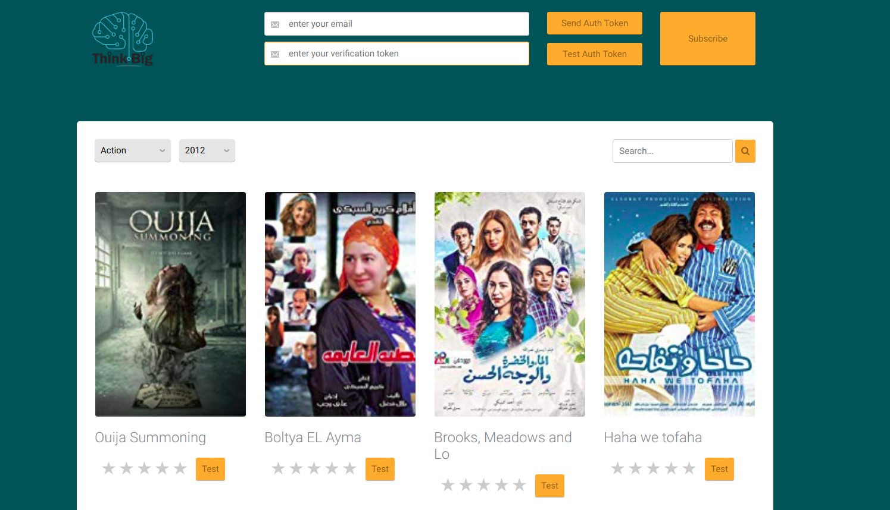

# Movie Recommendations Fe Assignment
This repository contains an assignment for our summer interns'19 candidates.

## Updates 
-Navbar
  -Added simple navbar with ability to search and subscribe button which pops up.
-Entrance
  -Background photo with parallax effect.
  -Logo,text and subscribe button again in the middle.
-New movies section
  -New movies' posters in divs with shadow when hover.
-Filter button
  -Using font awesome icon for filter.
  -When clicking the button it will disapear and show hidden section for filtering movies.
  -Confireming apply or cancel this will show the filter button angin.
-5 stars button
  -Just small change and rename it Rate.  
-Next page buttons
-My css file >> My-style.css
-My js file >> Myapp.js

## Screenshots 

.png)
.png)
.png)
.png)
.png)

